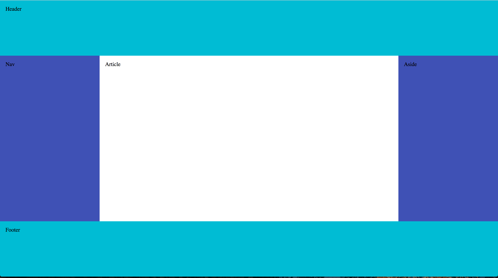
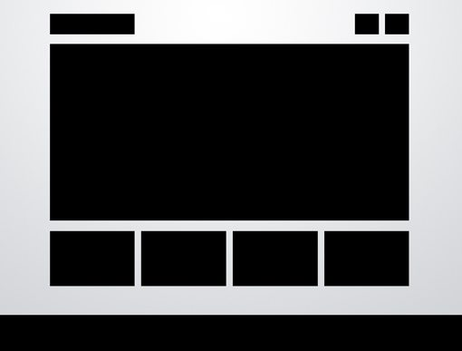
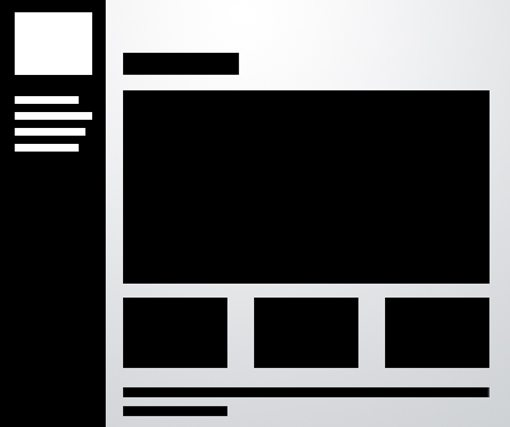
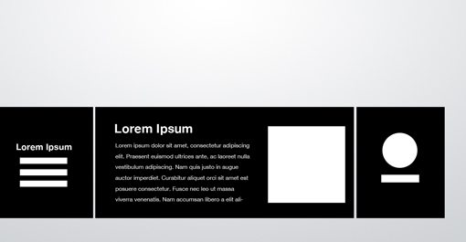

# Precourse: HTML + CSS

## Basic Requirements

- [ ] Exercise 1

  The layout looks like the below, but the header sticks at the top. Instead of disappearing as you scroll, the header stays at the very top of the page.

  Do not use Bootstrap for this exercise.

  

  

- [ ] Exercise 2

  Create a page to tell us about yourself.  Use whichever CSS layout system or library you prefer.  You may choose to model one of the suggested layouts below, or design your own.  You will share this page with other CC students (see Exercise 4) to help us get to know each other.

  

  

  

- [ ] Exercise 3

  Create a GitHub page for the little website you made in Exercise 2. How? Make a new repository, copy the files in there, and follow the directions [here](https://pages.github.com/).

## Advanced Requirements

- [ ] Add responsive design for everything. You can change the screen size on your browser. Then try playing around with Chrome's screen size tests.
- [ ] For exercise 2, make the footer 'stick' as well so only the article scrolls.
- [ ] Does it work in Internet Explorer? Please go check if everything stays the same in IE10.